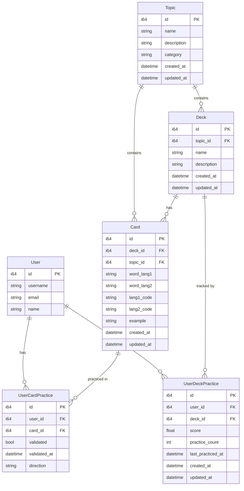

# Database Model

## Performance Optimizations

This schema is optimized for **blazing fast insertions and reads** with:
- Strategic indexes on foreign keys and frequently queried fields
- Composite indexes for common query patterns
- Partial indexes for time-based queries
- Unique constraints for O(1) lookups
- Optimized data types (VARCHAR vs TEXT, CHAR for codes)
- Denormalization where it improves query performance

See [OPTIMIZATION.md](./OPTIMIZATION.md) for detailed performance strategies.

## Entity Relationship Diagram

## Relationships

- **Topic → Deck**: One-to-Many (one topic can have many decks)
- **Topic → Card**: One-to-Many (one topic can have many cards)
- **Deck → Card**: One-to-Many (one deck contains many cards)
- **User → UserDeckPractice**: One-to-Many (user can practice multiple decks)
- **User → UserCardPractice**: One-to-Many (user can practice multiple cards)
- **Deck → UserDeckPractice**: One-to-Many (deck can be practiced by multiple users)
- **Card → UserCardPractice**: One-to-Many (card can be practiced multiple times by users)

