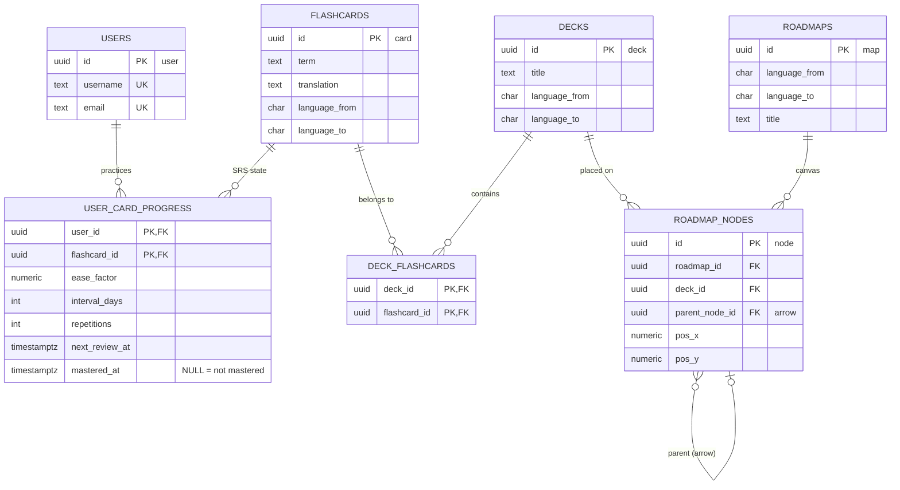

## Database Schema:

```mermaid
erDiagram
    USERS ||--o{ USER_CARD_PROGRESS : "practices"
    FLASHCARDS ||--o{ USER_CARD_PROGRESS : "SRS state"
    FLASHCARDS ||--o{ DECK_FLASHCARDS : "belongs to"
    DECKS ||--o{ DECK_FLASHCARDS : "contains"
    DECKS ||--o{ ROADMAP_NODES : "placed on"
    ROADMAPS ||--o{ ROADMAP_NODES : "canvas"
    ROADMAP_NODES }o--o| ROADMAP_NODES : "parent (arrow)"

    USERS {
        uuid id PK "user"
        text username UK
        text email UK
    }

    ROADMAPS {
        uuid id PK "map"
        char language_from
        char language_to
        text title
    }

    DECKS {
        uuid id PK "deck"
        text title
        char language_from
        char language_to
    }

    ROADMAP_NODES {
        uuid id PK "node"
        uuid roadmap_id FK
        uuid deck_id FK
        uuid parent_node_id FK "arrow"
        numeric pos_x
        numeric pos_y
    }

    FLASHCARDS {
        uuid id PK "card"
        text term
        text translation
        char language_from
        char language_to
    }

    DECK_FLASHCARDS {
        uuid deck_id PK,FK
        uuid flashcard_id PK,FK
    }

    USER_CARD_PROGRESS {
        uuid user_id PK,FK
        uuid flashcard_id PK,FK
        numeric ease_factor
        int interval_days
        int repetitions
        timestamptz next_review_at
        timestamptz mastered_at "NULL = not mastered"
    }
```