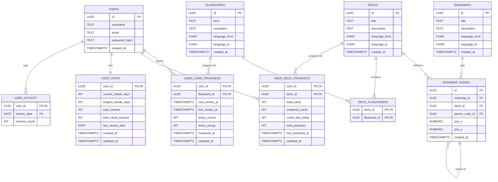

# mms-db

Database schema and models for the Matcha Time language learning application.

This crate contains the PostgreSQL database schema and related data structures for managing flashcards, decks, roadmaps, and user progress tracking.

## Database Schema

## Key Features

### Spaced Repetition System (SRS)

The database implements an SRS through the `user_card_progress` table, which tracks:
- Next review time for each flashcard (`next_review_at`)
- Review history (`times_correct`, `times_wrong`, `last_review_at`)
- Mastery status (`mastered_at`)

### Performance Optimizations

The schema includes several performance optimizations:

- **Partial indexes** for due cards (`next_review_at <= NOW()`) and mastered cards
- **Covering indexes** for practice session queries to avoid table lookups
- **Language pair indexes** for fast filtering of decks and roadmaps
- **Helper function** `refresh_deck_progress()` to efficiently update aggregated deck statistics

### Data Relationships

- **Flashcards** are reusable across multiple decks (many-to-many via `deck_flashcards`)
- **Roadmaps** organize decks into visual learning paths with positional coordinates
- **User Progress** is tracked at both card and deck levels for efficient queries
- **Activity Tracking** enables streak calculations and heatmap visualizations