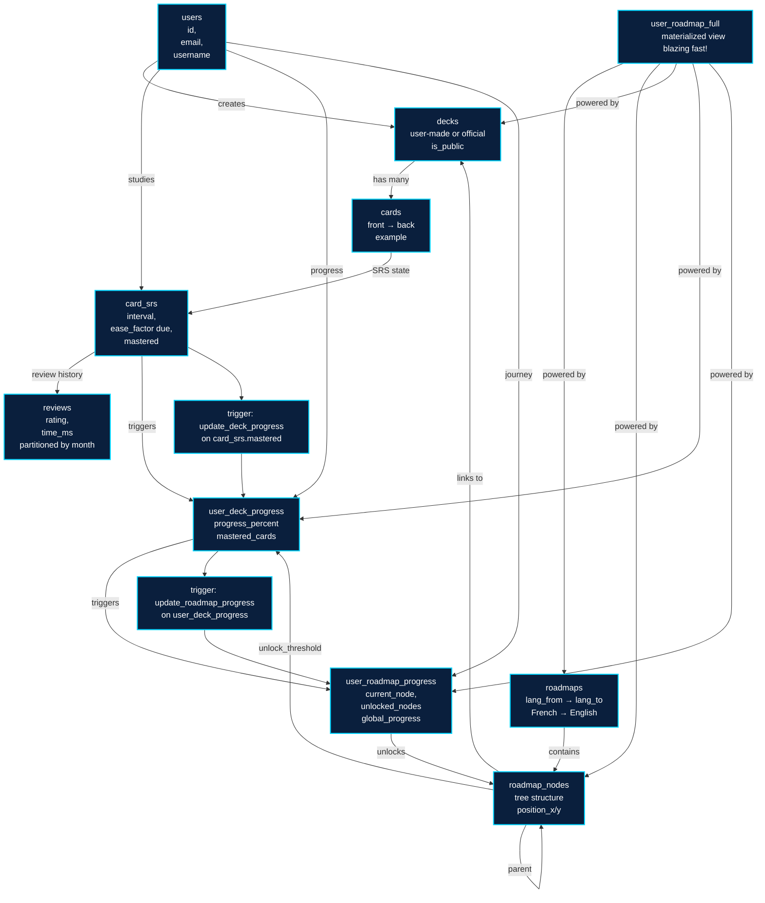

## Database Schema:

```mermaid
graph TD
    %% === STYLES ===
    classDef ocean fill:#0a1f3d,stroke:#00d4ff,stroke-width:2px,color:#fff,font-family:Arial;
    classDef user fill:#ff6b6b,stroke:#fff,stroke-width:3px,color:#fff;
    classDef roadmap fill:#4ecdc4,stroke:#fff,stroke-width:2px,color:#0a1f3d;
    classDef deck fill:#f7b731,stroke:#fff,stroke-width:2px,color:#0a1f3d;
    classDef card fill:#a29bfe,stroke:#fff,stroke-width:2px,color:#0a1f3d;
    classDef srs fill:#fd79a8,stroke:#fff,stroke-width:2px,color:#fff;
    classDef progress fill:#55efc4,stroke:#2d3436,stroke-width:2px,color:#2d3436;
    classDef view fill:#74b9ff,stroke:#fff,stroke-width:2px,color:#0a1f3d;
    classDef trigger fill:#fab1a0,stroke:#fff,stroke-width:2px,color:#0a1f3d;

    %% === ENTITIES ===
    U[users
        id,
        email, 
        username
    ]:::user
    R[roadmaps 
        lang_from → lang_to 
        French → English
    ]:::roadmap
    D[decks 
        user-made or official
        is_public
    ]:::deck
    N[roadmap_nodes
        tree structure
        position_x/y
    ]:::roadmap
    C[cards
        front → back
        example
    ]:::card
    S[card_srs
        interval,
        ease_factor due,
        mastered
    ]:::srs
    REV[reviews
        rating,
        time_ms
        partitioned by month
    ]:::progress
    UDP[user_deck_progress
        progress_percent
        mastered_cards
    ]:::progress
    URP[user_roadmap_progress
        current_node,
        unlocked_nodes
        global_progress
    ]:::progress
    MV[user_roadmap_full
        materialized view blazing fast!
    ]:::view

    %% === RELATIONSHIPS ===
    U -->|creates| D
    U -->|studies| S
    U -->|progress| UDP
    U -->|journey| URP

    R -->|contains| N
    N -->|links to| D
    N -->|parent| N
    N -->|unlock_threshold| UDP

    D -->|has many| C
    C -->|SRS state| S
    S -->|review history| REV
    S -->|triggers| UDP

    UDP -->|triggers| URP
    URP -->|unlocks| N

    %% Materialized Magic
    MV -->|powered by| R & N & D & UDP & URP

    %% === TRIGGERS ===
    T1[trigger: update_deck_progress<br/>on card_srs.mastered]:::trigger
    T2[trigger: update_roadmap_progress<br/>on user_deck_progress]:::trigger
    S --> T1 --> UDP
    UDP --> T2 --> URP

    %% === OCEAN THEME ===
    class U,R,D,N,C,S,REV,UDP,URP,MV,T1,T2 ocean
```